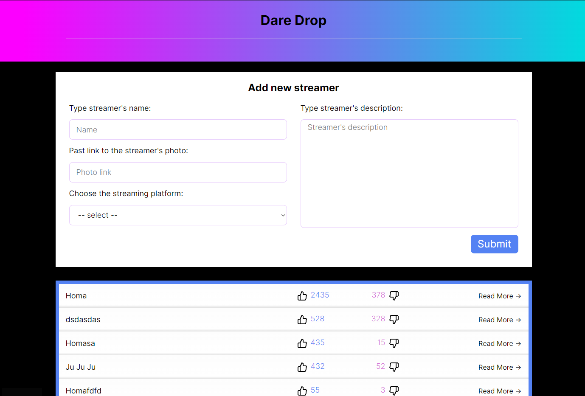

# Streamer Aggregator

This is a prototype of a streamer platform fragment, where you can add streamers, rate them, view their ratings, and read information about them.

## Features

- Add streamers to the platform
- Rate streamers based on your experience
- View ratings from other users
- Read detailed information about each streamer

## Installation

Before running the project, make sure you have SQLite installed on your system. If not, you can follow the official installation instructions [here](https://www.sqlite.org/download.html).

To run the project, perform the following steps:

1. Clone the repository to your local machine.
2. Navigate to the `server` directory, and run `npm start` to start the server-side of the application.
3. Open another terminal window, navigate to the `client` directory in your terminal and run `npm start` to start the client-side of the application.
4. In both the `client` and `server` directories, you will find an `.env` file for configuring ports, URLs, and the database address.

## Screenshots

*Screenshot 1: Home page*

*Screenshot 2: Profile page*

## Technologies Used

- React
- Node
- Nest
- Jest
- Prisma ORM
- SQLite

## License

This project is licensed under the [MIT License](LICENSE).
